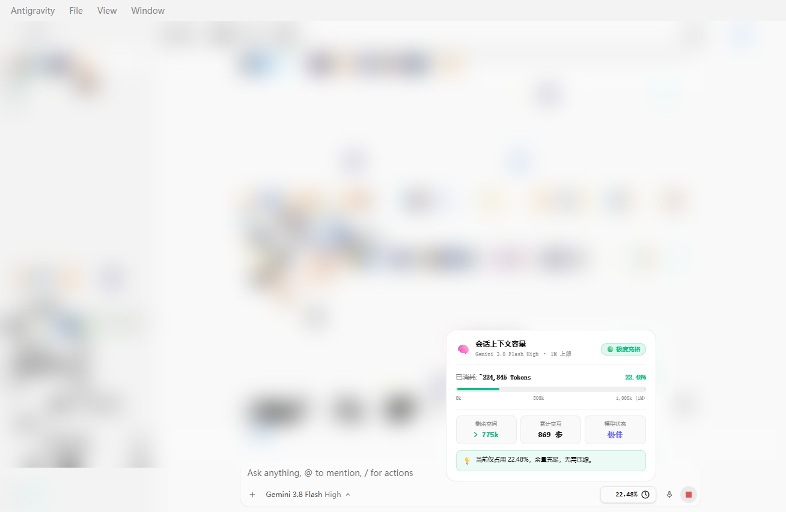
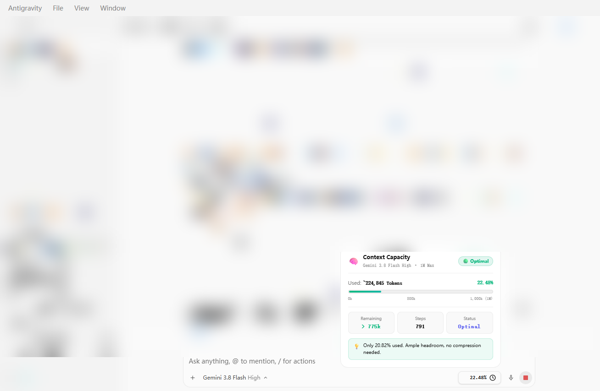

# 🧠 Antigravity Context Capacity Monitor
### Google Antigravity 2.0 上下文容量动态监控与可视化仪表盘插件

<p align="center">
  
  
  
  
  
</p>

[English](#english) | [中文说明](#chinese)

---

<p align="center">
  
  
</p>

---

<a name="english"></a>
## English

A lightweight, real-time context window capacity and token usage monitor custom-built for **Google Antigravity 2.0 Desktop**. Seamlessly embeds right into the bottom input toolbar next to the microphone button, expanding into a floating dashboard card on hover.

### 🌟 Key Features

- **⚡ Native Input Bar Integration**: Injects seamlessly into the bottom input toolbar without modifying any Antigravity application binaries.
- **🎨 350px Floating Dashboard (Hover to Expand)**:
  - **Dynamic Model Name**: Reads active model in real-time (e.g., `Gemini 3.8 Flash High · 1M Max` / `Claude Sonnet 4.6 (Thinking)`).
  - **Color-Coded Status Pulse**: 🟢 Optimal (<60%) ｜ 🟡 Moderate (60%~85%) ｜ 🔴 High Load (>85%).
  - **3 Metric Blocks**: Remaining tokens (`> 798k`), interaction steps (`772`), and health status (`Optimal`).
  - **Smooth Gradient Progress Bar**: Visualizes token progression across 0 ~ 1,000k (1M).
  - **Context Advice**: Provides timely tips for summarizing or running `/compact`.
- **🌐 Automatic Bilingual Selection**:
  - Automatically identifies system language. If Chinese (`zh`) -> Chinese UI; if non-Chinese -> English UI.
  - Engineered with strict layout constraints to prevent English text overflow, line breaks, or font misalignment.
- **🛡️ Auto-Reconnection & Zero-Crash Resilience**:
  - **Dynamic Port Hot-Discovery**: Continuously detects `%APPDATA%\Antigravity\DevToolsActivePort` to re-hook instantly whenever Antigravity restarts with a new ephemeral port.
  - **DOM Self-Healing**: Uses `MutationObserver` to re-mount the gauge automatically whenever the input container re-renders or navigates.
  - **Triple Persistence**: Integrates with Antigravity Sidecars, Windows Startup Registry, and Startup Folder for completely silent, background startup on reboot.

---

### 🚀 Quick Start (1-Click Install)

#### Requirements
- **Google Antigravity 2.0 Desktop**
- **Python 3.9+** (ensure `Add python.exe to PATH` was selected during installation)

#### Installation
1. Clone or download this repository:
   ```bash
   git clone https://github.com/wwwljxw/antigravity-context-monitor.git
   ```
2. Double-click **`install.bat`** (or run `python install.py`).
3. Launch or restart **Antigravity 2.0**.
4. The context gauge will immediately appear in your input box!

#### Uninstallation
- Double-click **`uninstall.bat`** (or run `python uninstall.py`) to cleanly terminate the background daemon and remove all configuration entries.

---

<a name="chinese"></a>
## 中文说明

为 **Google Antigravity 2.0 桌面客户端** 定制的轻量级实时上下文容量监控插件。通过本地调试管道与 DOM 监听机制，无侵入式地内嵌至输入框右下角。

### 🌟 核心功能

- **⚡ 输入框原生嵌入**：无缝融入 Antigravity 2.0 底部工具栏（麦克风图标正前方），丝滑契合原生暗色与明色主题。
- **🎨 350px 悬浮大卡片（鼠标悬停即弹）**：
  - **实时模型名称感知**：动态捕获当前会话选用的模型（如 `Gemini 3.8 Flash High · 1M 上限` / `Claude Sonnet 4.6 (Thinking)`）。
  - **三色呼吸警示灯**：🟢 极度充裕 (<60%) ｜ 🟡 容量适中 (60%~85%) ｜ 🔴 容量偏高 (>85%)。
  - **三核心指标网格**：剩余可用空间 (`> 798k`)、累计交互步数 (`772`)、模型状态 (`极佳`)。
  - **全景渐变进度条**：直观展示 0 ~ 1,000k (1M) 上下文消耗进展。
  - **阶段健康建议**：提供精准的阶段性总结与 `/compact` 压缩提示。
- **🌐 中英双语自动切换（非中文 ➡️ 英文）**：
  - 自动读取系统语言：中文环境直接显示中文，非中文环境（英文等）自动呈现为地道的英文排版。
  - 针对英文字符较长特点进行了专门的防溢出重构，绝不发生折行、错位或内容截断。
- **🛡️ 动态端口热重连与全方位常驻**：
  - **动态端口热感知**：自动监听 `%APPDATA%\Antigravity\DevToolsActivePort`，Antigravity 重启更换随机端口后 2 秒内无缝热重连。
  - **DOM 自动挂载**：内置 `MutationObserver`，切换会话、页面 `Ctrl+R` 刷新或重新输入时自动重绘自愈。
  - **三重系统级守护**：同时支持 Antigravity Sidecar、Windows 注册表 `Run` 自启以及启动文件夹双保险，开机完全静默运行，内存消耗仅约 20MB，CPU 占用近乎 0%。

---

### 🚀 一键安装与使用

#### 前置环境
- 已安装 **Antigravity 2.0 桌面版**
- 已安装 **Python 3.9+**（安装时勾选了 `Add python.exe to PATH`）

#### 安装步骤
1. 下载或克隆本项目：
   ```bash
   git clone https://github.com/wwwljxw/antigravity-context-monitor.git
   ```
2. 双击项目根目录下的 **`一键安装.bat`**（或直接运行 `python install.py`）。
3. 打开或重启 **Antigravity 2.0**。
4. 输入框右下角即可看到呼吸跳动的小胶囊，鼠标悬停即可浮出仪表盘！

#### 卸载步骤
- 双击 **`一键卸载.bat`**（或运行 `python uninstall.py`）即可一键彻底停止进程并清理所有文件和自启项。

---

### 📂 项目结构

```text
antigravity-context-monitor/
├── assets/                  # 演示截图
│   ├── preview_zh.png       # 中文界面效果图
│   └── preview_en.png       # 英文界面效果图
├── skills/
│   └── context-monitor/
│       ├── SKILL.md         # Antigravity 技能元数据
│       └── scripts/
│           ├── daemon_sync.py       # 后台热探测、动态计算与 DOM 驱动引擎
│           ├── generate_monitor.py  # 会话容量分析与 Markdown 卡片生成器
│           └── inject_gauge.py      # CDP 前端组件注入脚本
├── plugin.json              # 插件配置文件
├── install.py / install.bat # 双语自适应一键安装器
├── uninstall.py / uninstall.bat # 双语一键卸载器
├── LICENSE                  # MIT 开源协议
└── README.md                # 中英双语项目说明
```

---

### 📄 License

本项目基于 [MIT License](LICENSE) 开源。欢迎 Star 与 Fork！
